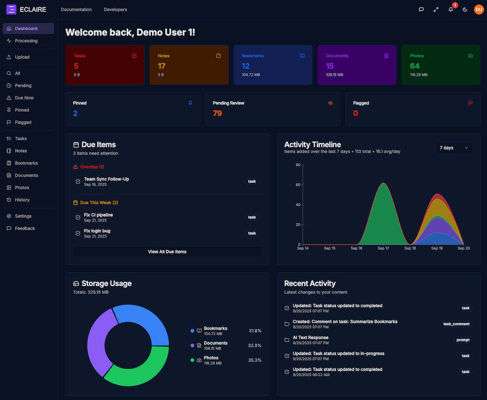
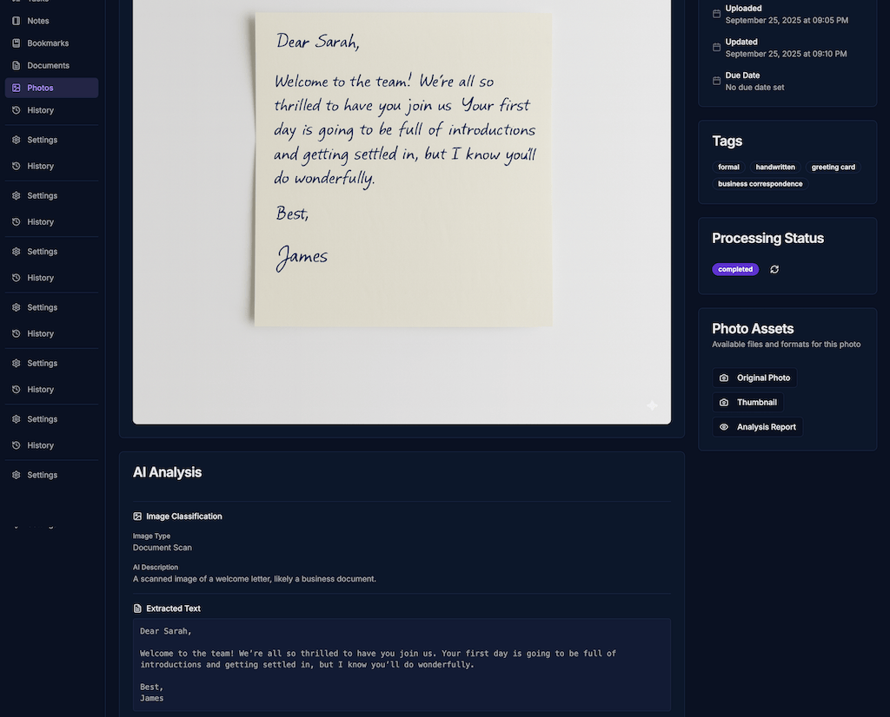
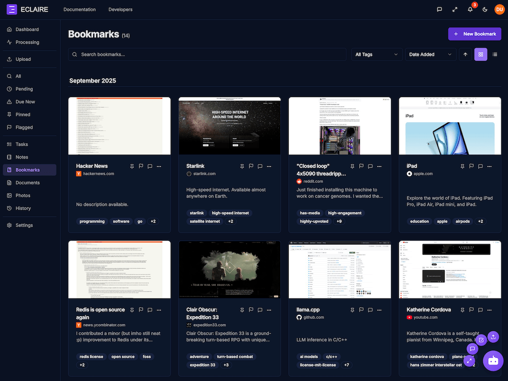
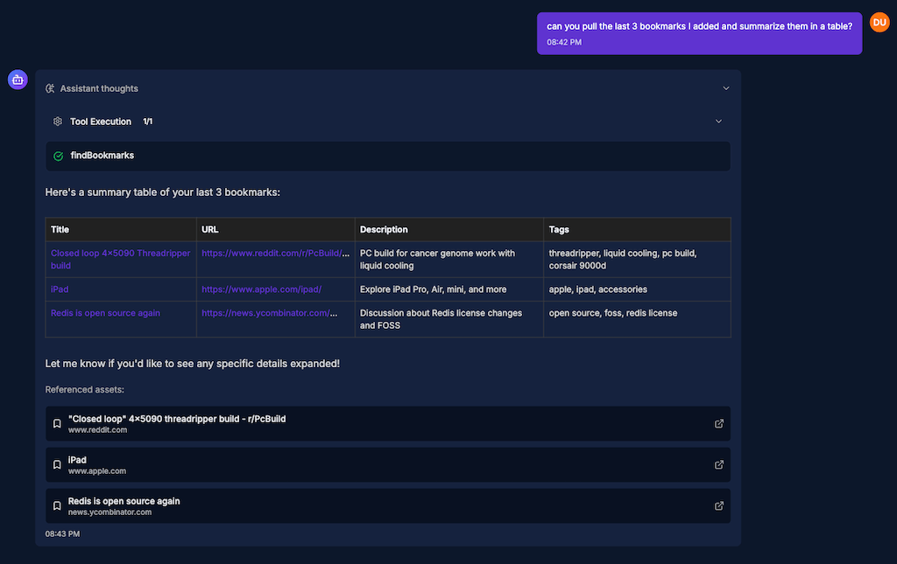

<!-- README.md -->

<p align="center">
  <a href="https://eclaire.co">
    
  </a>
</p>

<h1 align="center">ECLAIRE</h1>

<h3 align="center"><em>Privacy-focused AI assistant for your data</em></h3>

<p align="center">
  <a href="./LICENSE"></a>
  <a href="https://github.com/eclaire-labs/eclaire/releases"></a>
  <a href="https://eclaire.co/docs"></a>
  <a href="https://youtu.be/JiBnoTmev0w"></a>
</p>

<p align="center" id="demo">
  <a href="https://youtu.be/JiBnoTmev0w" target="_blank" rel="noopener">
    
  </a>
  <br/>
  <sub><em>Click to watch on YouTube</em></sub>
</p>

<p align="center">
  <a href="#features">Features</a> •
  <a href="#installation">Installation</a> •
  <a href="#selecting-models">Selecting Models</a> •
  <a href="#architecture">Architecture</a> •
  <a href="#development">Development</a> •
  <a href="#contributing">Contributing</a> •
  <a href="https://eclaire.co/docs">Docs</a> •
  <a href="https://eclaire.co/docs/api">API</a>
</p>

---

## ⚠️ Important Notices

> [!IMPORTANT]  
> **Pre-release / Development Status**  
> Eclaire is currently in pre-release and under active development.  
Expect frequent updates, breaking changes, and evolving APIs/configuration.  
> If you deploy it, please **backup your data regularly** and review release notes carefully before upgrading.

> [!WARNING]  
> **Security Warning**  
> Do **NOT** expose Eclaire directly to the public internet.  
> This project is designed to be self-hosted with privacy and security in mind, but it is **not hardened for direct exposure**.  
>  
> We strongly recommend placing it behind additional security layers such as:  
> - [Tailscale](https://tailscale.com/) or other private networks/VPNs  
> - [Cloudflare Tunnels](https://developers.cloudflare.com/cloudflare-one/connections/connect-apps/)  
> - A reverse proxy with authentication

---

## Description

**Eclaire** is a local-first, open-source AI that organizes, answers, and automates across tasks, notes, documents, photos, bookmarks and more.

There are are lot of existing frameworks and libraries enabling various AI capabilities; few deliver a complete product allowing users to get things done. Eclaire assembles proven building blocks into a cohesive, privacy-preserving solution you can run yourself.

With AI gaining rapid adoption, there is a growing need for alternatives to closed ecosystems and hosted models, especially for personal, private, or otherwise sensitive data.

- **Self-hosted**  - runs entirely on your hardware with local models and data storage
- **Unified data**  - one place where AI can see and connect everything
- **AI-powered**  - content understanding, search, classification, OCR, and automation
- **Open source**  - transparent, extensible, and community-driven

### What's New in v0.6.0

- **Simplified self-hosting**  - Single unified container, optional Redis
- **SQLite support**  - Lightweight alternative to Postgres
- **Expanded AI models**  - Vision models, llama.cpp router, MLX backends
- **Auto-upgrades**  - Database migrations run automatically on startup

See the [CHANGELOG](./CHANGELOG.md) for full details.
  
## Features
- **Cross-platform**: macOS, Linux and Windows. 
- **Private by default**: By default all AI models run locally, all data is stored locally.
- **Unified data**: Manage across tasks, notes, documents, photos, bookmarks and more.
- **AI conversations**: chat with context from your content; see sources for answers; supports streaming and thinking tokens.
- **AI tool calling**: The assistant has tools to search data, open content, resolve tasks, add comments, create notes, and more
- **Flexible deployment**: Run as a single unified container or separate services. SQLite or Postgres. Database queue or Redis. *(See [Architecture](#architecture) section below.)*
- **Full API**: OpenAI-compatible REST endpoints with session tokens or API keys. [API Docs](https://eclaire.co/docs/api)
- **Model backends**: works with llama.cpp, vLLM, mlx-lm/mlx-vlm, LM Studio, Ollama, and more via the standard OpenAI-compatible API. *(See [Selecting Models](#selecting-models).)*
- **Model support**: text and vision models from Qwen, Gemma, DeepSeek, Mistral, Kimi, and others. *(See [Selecting Models](#selecting-models).)*
- **Storage**: all assets (uploaded or generated) live in Postgres or file/object storage.
- **Integrations**: Telegram (more channels coming).
- **Documents**: PDF, DOC/DOCX, PPT/PPTX, XLS/XLSX, ODT/ODP/ODS, MD, TXT, RTF, Pages, Numbers, Keynote, HTML, CSV, and more.
- **Photos/Images**: JPG/JPEG, PNG, SVG, WebP, HEIC/HEIF, AVIF, GIF, BMP, TIFF, and more.
- **Tasks**: track user tasks or assign tasks for the AI assistant to complete; the assistant add comments to tasks or write to separate docs.
- **Notes**: plain text or Markdown format. Links to other assets.
- **Bookmarks**: Fetches bookmarks and creates PDF, Readable and LLM friendly versions. Special handling for Github and Reddit APIs and metadata.
- **Organization**: Tags, pin, flag, due dates, etc. across all asset types.
- **Hardware acceleration**: takes advantage of Apple MLX, NVIDIA CUDA, and other platform-specific optimizations.
- **Mobile & PWA**: installable PWA; iOS & Apple Watch via Shortcuts; Android via Tasker/MacroDroid.

## Sample use cases
- Dictate notes using Apple Watch (or other smartwatch).
- Save bookmarks to read later; generate clean “readable” and PDF versions.
- Create readable and PDF versions of websites
- Extract text from photos and document images (OCR).
- Bulk-convert photos from HEIC to JPG.
- Analyze, categorize, and search documents and photos with AI.
- Create LLM-friendly text/Markdown versions of documents and bookmarks.
- Save interesting content (web pages, photos, documents) from phone, tablet, or desktop.
- Ask AI to find or summarize information across your data.
- Schedule automations (e.g., “Every Monday morning, summarize my tasks for the week.”).
- Chat with AI from web, mobile, Telegram, and other channels.
- Process sensitive information (bank, health, etc.) privately on local models.
- De-clutter your desktop by bulk-uploading and letting AI sort and tag.
- Migrate data from Google/Apple and other vendors into an open, self-hosted platform under your control.

## Screenshots

<table>
  <tr>
    <td><a href="docs/images/dashboard-dark-fs8.png"></a></td>
    <td><a href="docs/images/photo-ocr-dark-fs8.png"></a></td>
  </tr>
  <tr>
    <td><a href="docs/images/main-dark-fs8.png"></a></td>
    <td><a href="docs/images/assistant-dark-fs8.png"></a></td>
  </tr>
</table>


## Installation

### Prerequisites

- **Docker** and **Docker Compose**
- **A local LLM server**  - [llama.cpp](https://github.com/ggml-org/llama.cpp) recommended

### Quick Start

```bash
mkdir eclaire && cd eclaire
curl -fsSL https://raw.githubusercontent.com/eclaire-labs/eclaire/main/setup.sh | sh
```

The script will:
1. Download configuration files
2. Generate secrets automatically
3. Initialize the database (PostgreSQL)

After setup completes:

```bash
# 1. Start your LLM servers (in separate terminals)
#    Models download automatically on first run
llama-server -hf unsloth/Qwen3-14B-GGUF:Q4_K_XL --ctx-size 16384 --port 11500
llama-server -hf unsloth/gemma-3-4b-it-qat-GGUF:Q4_K_XL --ctx-size 16384 --port 11501

# 2. Start Eclaire
docker compose up -d
```

Open http://localhost:3000 and click "Sign up" to create your account.

### Configuration

Configuration lives in two places:
- **`.env`**  - secrets, database settings, ports
- **`config/ai/`**  - LLM provider URLs and model definitions

### Upgrading

```bash
cd eclaire
docker compose pull
docker compose run --rm eclaire upgrade
docker compose up -d
```

### Stopping

```bash
docker compose down
```


## Selecting Models

Eclaire uses AI models for two purposes:
- **Backend**: Powers the chat assistant (requires good tool calling)
- **Workers**: Processes documents and images (requires vision capability)

> **Apple Silicon**: Mac users can leverage MLX for optimized local inference. See the [configuration guide](docs/ai-models.md#mlx-on-apple-silicon) for details.

Use the CLI to manage models:

```bash
docker compose run --rm eclaire model list
```

See [AI Model Configuration](docs/ai-models.md) for detailed setup and model recommendations. 

## Architecture

Eclaire follows a modular architecture with clear separation between the frontend, backend API, background workers, and data layers.

**📋 [View detailed architecture diagram →](docs/architecture.md)**

### Key Components
- **Frontend**: Vite web application with React 19, TanStack Router, and Radix UI
- **Backend API**: Node.js/Hono server with REST APIs
- **Background Workers**: Job processing and scheduling (runs unified with backend by default)
- **Data Layer**: PostgreSQL (recommended) or SQLite for persistence; database or Redis for job queue
- **AI Services**: Local LLM backends (llama.cpp, MLX, LM Studio, etc.) for inference; Docling for document processing
- **External Integrations**: GitHub and Reddit APIs for bookmark fetching

## Roadmap
- Native mobile and desktop clients
- Support for more data sources and integrations
- Data source linking and synchronization
- More robust full text indexing and search
- Better extensibility and plugin system
- Improved AI capabilities and model support
- Evals for models and content pipelines
- More hardening and security
- Top requests from the community

## Development

For contributors who want to build from source.

### Additional Prerequisites

Beyond Docker and an LLM server, you'll need:

- **Node.js ≥ 24** with corepack enabled
- **pnpm** (managed via corepack)
- **PM2** process manager (`npm install -g pm2`)

**Document/image processing tools:**

**macOS:**
```bash
brew install --cask libreoffice
brew install poppler graphicsmagick imagemagick ghostscript libheif
```

**Ubuntu/Debian:**
```bash
sudo apt-get install libreoffice poppler-utils graphicsmagick imagemagick ghostscript libheif-examples
```

### Setup

```bash
git clone https://github.com/eclaire-labs/eclaire.git
cd eclaire
corepack enable
pnpm setup:dev
pnpm dev
```

Access the application:
- Frontend: http://localhost:3000
- Backend: http://localhost:3001/health

### Building Docker Locally

To build and test custom Docker images:

```bash
./scripts/build.sh
docker compose -f compose.yaml -f compose.dev.yaml -f compose.local.yaml up -d
```

## Contributing
We 💙 contributions! Please read the Contributing Guide.

## Security
See [SECURITY.md](./SECURITY.md) for our policy.

## Telemetry
There should be no telemetry in the Eclaire code although 3rd party dependencies may have. If you find an instance where that is the case, let us know.

## Community & Support
Issues: [GitHub Issues](https://github.com/eclaire-labs/eclaire/issues)
